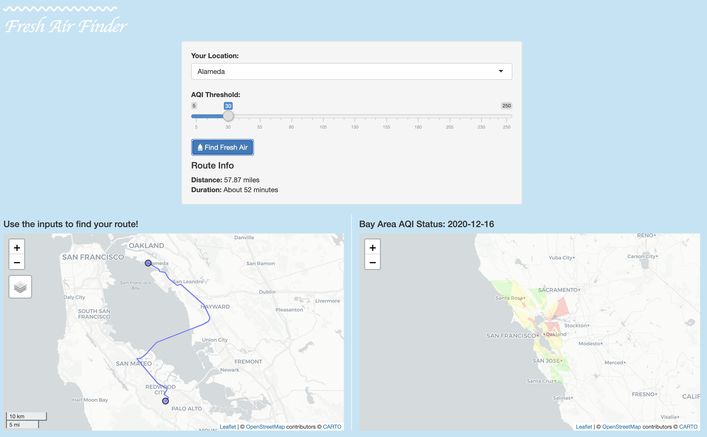

# freshAirFinderApp

<!-- badges: start -->
<!-- badges: end -->

The goal of freshAirFinderApp is to find fresh air in the greater Bay Area.

## Installation

You can install freshAirFinderApp from GitHub with:

``` r
remotes::install_github("daranzolin/freshAirFinderApp")
```

## Run the app

``` r
library(freshAirFinderApp)
freshAirFinder()
```



